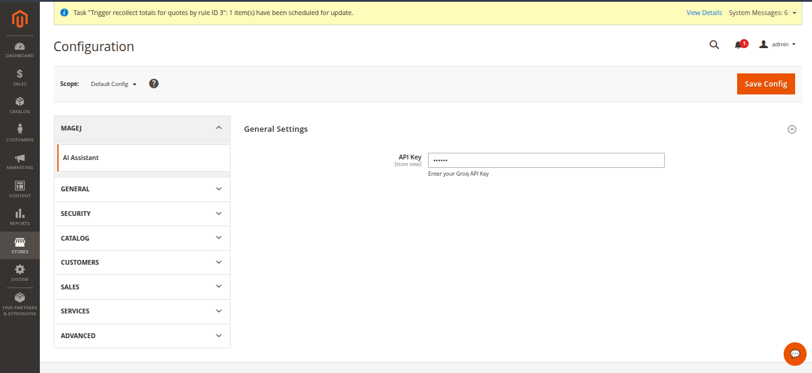
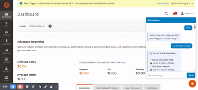

# 🤖 MageJ AI Admin Assistant for Magento 2

A powerful AI-powered assistant integrated directly into the Magento 2 Admin Panel.
This module allows administrators to query store data, generate reports, and get instant guidance using natural language.

---

## 🚀 Features

* 💬 AI Chat inside Admin Panel
* 📊 Store Data Insights (Orders, Customers, Sales, Products)
* 📦 Product Details with Stock Information
* 👤 Customer Details & Order History
* 🧾 Order Details Lookup
* 📈 Reports (Today, Last X Days)
* 🏬 Store View Information
* 🔐 Secure API Key via Admin Configuration
* 💾 Session-based Chat History

---

## 🧠 Supported Queries

### 📦 Product

* `product detail Product Name`
* `show product details for Product Name`
* `Top sealling product`
* `low stock product`
* `out of stock product`

### 👤 Customer

* `customer detail for Customer Name`
* `customer detail for Customer email`
* `repeat customers`
* `Total customers`
* `Top customers`

### 🧾 Orders

* `order details 000000001`
* `last order id`
* `orders today`
* `orders last 7 days`
* `jan 2026 orders`
* `orders of customer name`
* `jan 2026 to april 2026 order count`

### 📊 Reports

* `today report`
* `total sales today`
* `report for last 5 days`
* `report for april 2026`
* `report for jan 2026 to april 2026`

### 🏬 Store

* `active stores`
* `all stores`
* `inactive stores`

### 🏬 General questions 

* `What is Seo`
* `how to change elastic search`
* `how to create new attribute`
`And More`

---

## ⚙️ Installation

### Manual Installation  (Zip)

1. Copy module to:

```
app/code/MageJ/AIAdminAssistant
```

2. Run commands:

```bash
php bin/magento setup:upgrade
php bin/magento setup:di:compile
php bin/magento setup:static-content:deploy -f
php bin/magento cache:flush
```
---


## 🔑 API Key Setup (IMPORTANT)

This module uses **Groq API (OpenAI-compatible)**.

### Step 1: Generate API Key

1. Go to Groq Console
2. Sign up / Login
3. Navigate to **API Keys**
4. Click **Create API Key**
5. Copy the generated key

---

### Step 2: Configure in Magento

Navigate to:

```
Admin → Stores → Configuration → MageJ → AI Admin Assistant
```

* Paste your API Key
* Click **Save Config**
* Clear cache

<p align="center">
  
</p>

---

## 🛠️ How It Works

1. Admin enters a query in chat
2. Request is sent to AI API
3. AI returns:

   * Natural language response OR
   * Structured JSON intent
4. Module detects intent
5. Magento data is fetched dynamically
6. Response is displayed in styled chat UI

---

## 🔐 Security

* API key stored securely in Magento configuration
* No hardcoded credentials
* Session-based chat (no database storage)

---

## ⚠️ Requirements

* Magento 2.4.x
* Internet connection (for AI API)

---

## 🐞 Troubleshooting

### ❌ API not working

* Verify API key is correct
* Check internet connection
* Review logs in:
* check log file for any error:
```
var/log/ai-debug.log
```
---

## 🖼️ Preview

<p align="center">
  
</p>

---

## 🧩 Compatibility

- Magento 2.4.x
- Multi-store environments

---

## 📞 Support

For any setup help or queries, feel free to contact:
```
jiyakmistry@gmail.com
```
****

## 📄 License
This module is licensed under the MIT License.

---

🔥 *Built to make Magento Admin smarter with AI*
