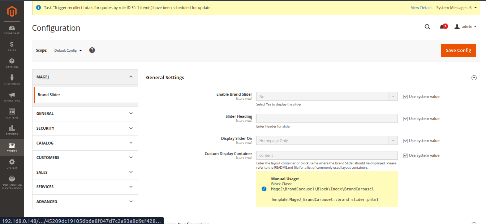
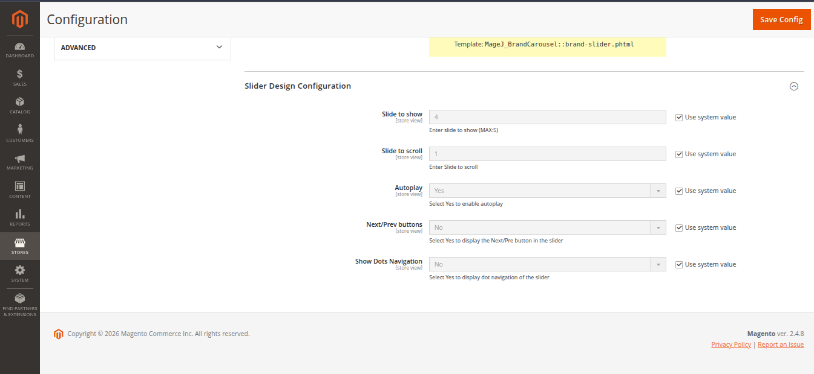
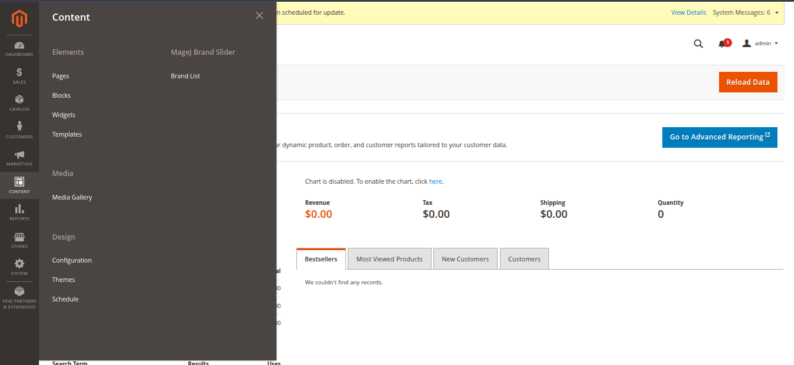
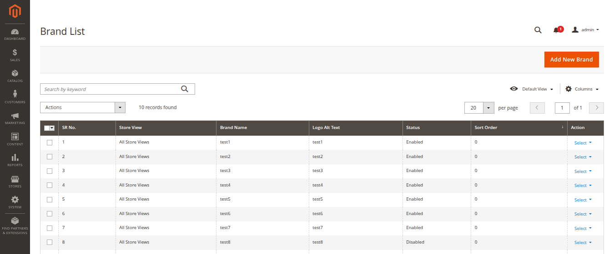
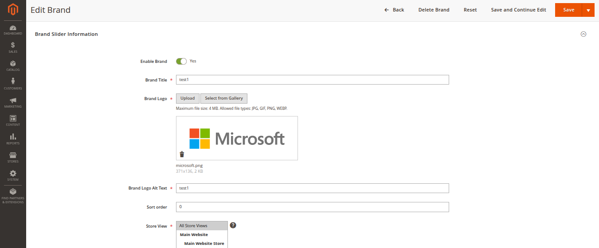
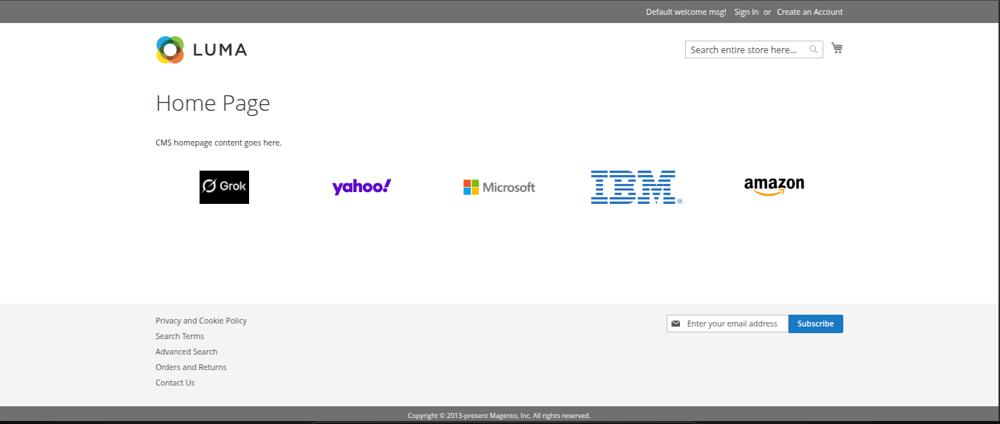
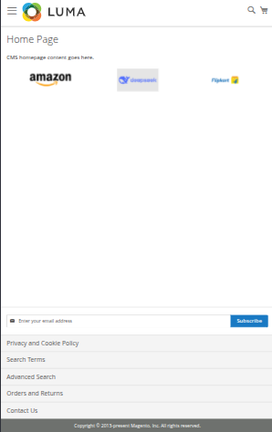

# Mage2 Module: MageJ_BrandCarousel

`magej/module-brandcarousel`

---

## 📌 Overview

**Magento 2 Brand Carousel** by MageJ allows store owners to create and manage brand logos and display them in a responsive Carousel anywhere on the storefront.

The extension provides full admin control, layout container selection, store view support, and seamless compatibility with modern themes including **Luma**.

Showcase your brand partners professionally and improve customer trust and brand visibility.

---

## 🚀 Key Features

- Create and manage brands from admin panel
- Upload brand logo images
- Assign brands to specific store views
- Enable / Disable individual brands
- Custom sort order management
- Select frontend display container
- Automatic layout block injection
- Duplicate block prevention
- Hyvä Theme compatible
- Luma Theme compatible
- Multi-store support
- Lightweight and performance-friendly

---

## 🎯 Benefits

- Increase brand credibility
- Improve storefront appearance
- Fully customizable placement
- Easy management without coding
- Works with most Magento 2 themes

---


## 📦 Installation

### Method 2: Manual Installation (Zip)

1. Unzip the extension into:

```
app/code/MageJ/BrandCarousel
```

2. Run the following commands:

```bash
php bin/magento module:enable MageJ_BrandCarousel
php bin/magento setup:upgrade
php bin/magento setup:static-content:deploy -f
php bin/magento cache:flush
```

---

## ⚙️ Configuration

Navigate to:

```
Stores → Configuration → MageJ → Brand Carousel
```

### Available Settings

- Enable / Disable module
- Select layout container
- Set sort order
- Store view scope configuration

<p align="center">
  
  
</p>

---

## 📍 Layout Placement Guide

The Brand Carousel can be displayed in different areas of the storefront using Magento layout containers.

### Common Layout Containers

- `page.top` → After header  
- `content` → Main content area  
- `page.bottom` → Before footer  
- `header.container` → Inside header  
- `footer-container` → Inside footer  
- `after.body.start` → After body tag opens  
- `before.body.end` → Before body tag closes  

> **Note:** Container availability depends on the active theme layout structure.

---

## 🛠 Admin Management

Navigate to:

```
Admin → Content → MageJ Brand Slider → Brand List
```

The module adds a dedicated Brand Management grid where you can:

- Add new brands
- Edit existing brands
- Delete brands
- Manage store view visibility
- Control display order

<p align="center">
  
  
    

</p>

---

## 🔧 Technical Specifications

- Module Name: `MageJ_BrandCarousel`
- Composer Package: `MageJ/module-brandcarousel`
- Magento Version: 2.4.x
- PHP Version: 8.x supported
- No core overrides
- Follows Magento 2 coding standards
- Observer-based layout injection

---

## 🖼️ Preview

<p align="center">
  
  
  
</p>

---

## 🧩 Compatibility

- Magento 2.4.x
- Luma Theme
- Multi-store environments

---

## 📞 Support

For any setup help or queries, feel free to contact:
```
jiyakmistry@gmail.com
```
****

---

## 📄 License
This module is licensed under the MIT License.

