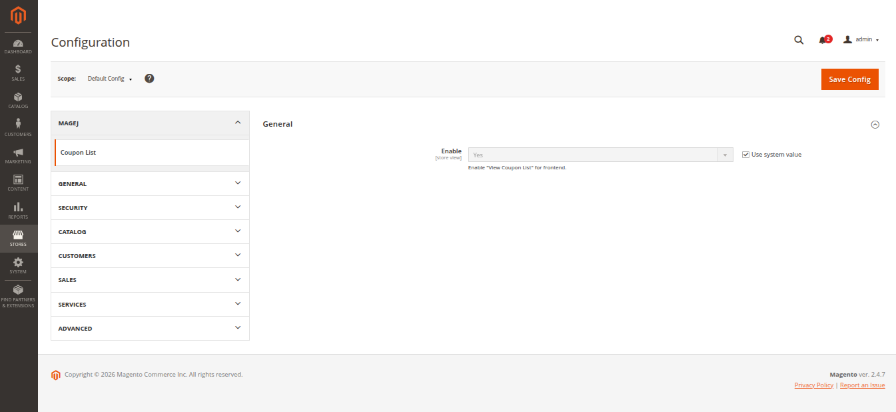
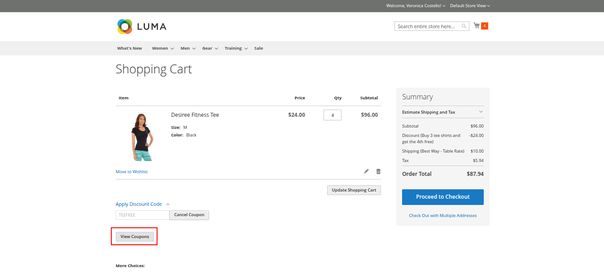
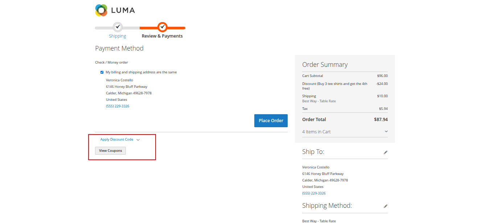
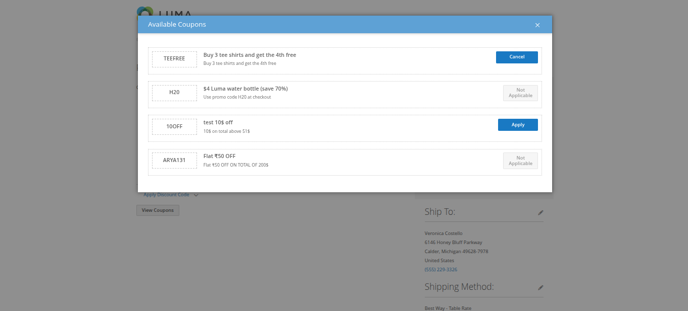

# 🎟️ Mage2 Module: MageJ_CouponList

`magej/module-couponlist`

---

## 📌 Overview

A powerful Coupon List module for Magento 2 that helps customers discover and apply available discount coupons directly from the Cart and Checkout pages.

The module improves customer engagement by displaying all applicable coupons in a clean popup interface, allowing shoppers to quickly apply the best available offers without manually searching for coupon codes.

---

## 🚀 Features

* 🎟️ Display available coupons on Cart & Checkout pages
* 💬 Popup-based coupon listing interface
* ⚡ One-click coupon apply functionality
* 🛒 Supports Cart and Checkout pages
* 👤 Automatically filters restricted coupons
* ❌ Removes expired and invalid coupons automatically
* 🔐 Admin control to show / hide coupons
* 🎯 Customer-friendly discount experience
* 🧠 Lightweight and Magento-native implementation

---

## ⚙️ Installation

### Manual Installation (Zip)

1. Unzip the extension into:

```bash
app/code/MageJ/CouponList
```

2. Run the following commands:

```bash
php bin/magento module:enable MageJ_CouponList
php bin/magento setup:upgrade
php bin/magento setup:static-content:deploy -f
php bin/magento cache:flush
```

---

## 🛠 Admin Management

Navigate to:

```bash
Admin → Stores → Configuration → MageJ → Coupon List
```

### Available Settings

* Enable / Disable module
<p align="center">
  
</p>

---

## 🎯 Benefits

* Improve customer conversion rate
* Increase coupon usage
* Enhance shopping experience
* Help customers discover offers easily
* Reduce abandoned carts

---

## 🧠 How It Works

1. Customer visits Cart or Checkout page
2. Available coupons are fetched dynamically
3. Invalid / expired coupons are filtered automatically
4. Coupons are displayed in popup list
5. Customer clicks coupon to apply instantly

---

## 🔧 Technical Specifications

* Module Name: `MageJ_CouponList`
* Composer Package: `magej/module-couponlist`
* Magento Version: 2.4.x
* No core overrides
* Follows Magento 2 coding standards
* Popup-based frontend implementation

---

## 🖼️ Preview

---
Cart & checkout page
---

<p align="center">
  
  
</p>

---
Coupon Listing Popup
---
<p align="center">
  
</p>

---

## 🧩 Compatibility

* Magento 2.4.x
* Luma Theme
* Multi-store environments
* Mobile, Tablet, Desktop views

---

## 📞 Support

For any setup help or queries, feel free to contact:

```bash
jiyakmistry@gmail.com
```

---

## 📄 License

This module is licensed under the MIT License.

---

🚀 *Built to improve coupon visibility and enhance Magento checkout experience*
