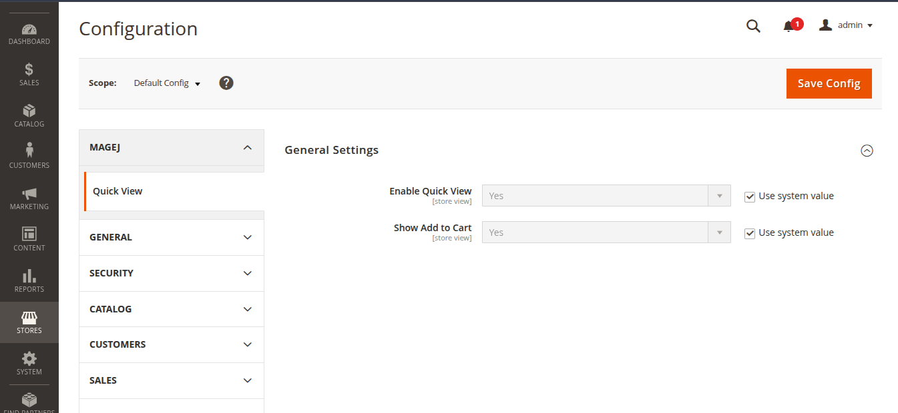
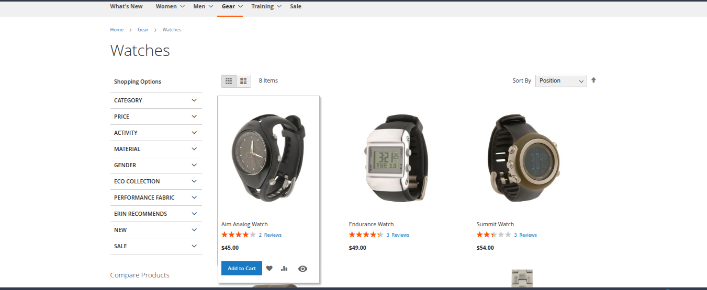
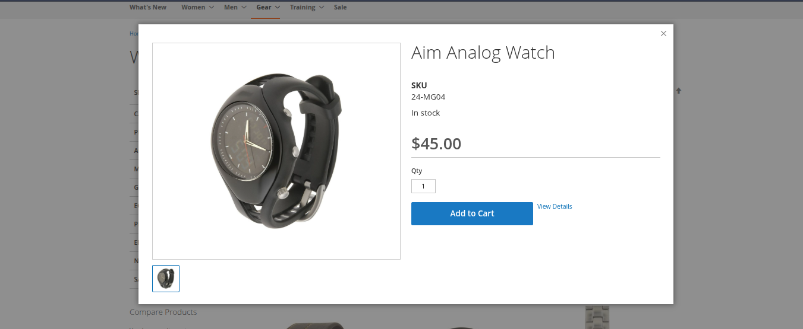
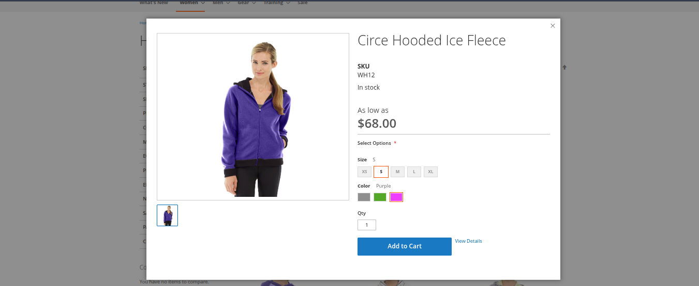

# Mage2 Module: MageJ_QuickView

`magej/module-quickview`

---

## 📌 Overview

A powerful Quick View module for Magento 2 that allows customers to preview products in a modal popup with full support for configurable products, including dynamic price updates, image switching, and seamless Add to Cart functionality.

---

## 🚀 Features

* 👁️ Quick View popup from product listing
* ⚡ AJAX-based product loading
* 🔄 Full configurable product support
* 💰 Dynamic price update on swatch selection
* 🖼️ Image update on swatch selection
* 🛒 AJAX-based Add to Cart
* 📦 Simple product support (direct price display)
* 🧠 KnockoutJS-based UI rendering
* 🎯 Magento-native behavior inside modal

---

## 🧩 Supported Product Types

### ✅ Configurable Products

* Swatches (color, size, etc.)
* Dynamic price updates
* Dynamic image switching
* Accurate simple product selection
* Native Magento behavior replication

---

### ✅ Simple Products

* Direct price display
* No swatches
* Clean minimal UI

---

## ⚙️ Installation

### Manual Installation (Zip)

1. Unzip the extension into:

```
app/code/MageJ/BrandCarousel
```

2. Run the following commands:

```bash
php bin/magento module:enable MageJ_BrandCarousel
php bin/magento setup:upgrade
php bin/magento setup:static-content:deploy -f
php bin/magento cache:flush
```

---

## 🛠 Admin Management

Navigate to:

```
Admin → Content → MageJ → Quick View
```

### Available Settings

- Enable / Disable module
- Show/ Hide add to cart butoon in quick view

<p align="center">
  
</p>

---

## 🔧 Technical Specifications

- Module Name: `MageJ_QuickView`
- Composer Package: `magej/module-quickview`
- Magento Version: 2.4.x
- No core overrides
- Follows Magento 2 coding standards

---

## 🖼️ Preview

<p align="center">
  
  
  
</p>

---

## 🧩 Compatibility

- Magento 2.4.x
- Luma Theme
- Multi-store environments
- Mbile, Tablate, Desktop views.
---

## 📞 Support

For any setup help or queries, feel free to contact:
```
jiyakmistry@gmail.com
```
****

---

## 📄 License
This module is licensed under the MIT License.

---

🚀 *Built to enhance Magento shopping experience with speed and usability*